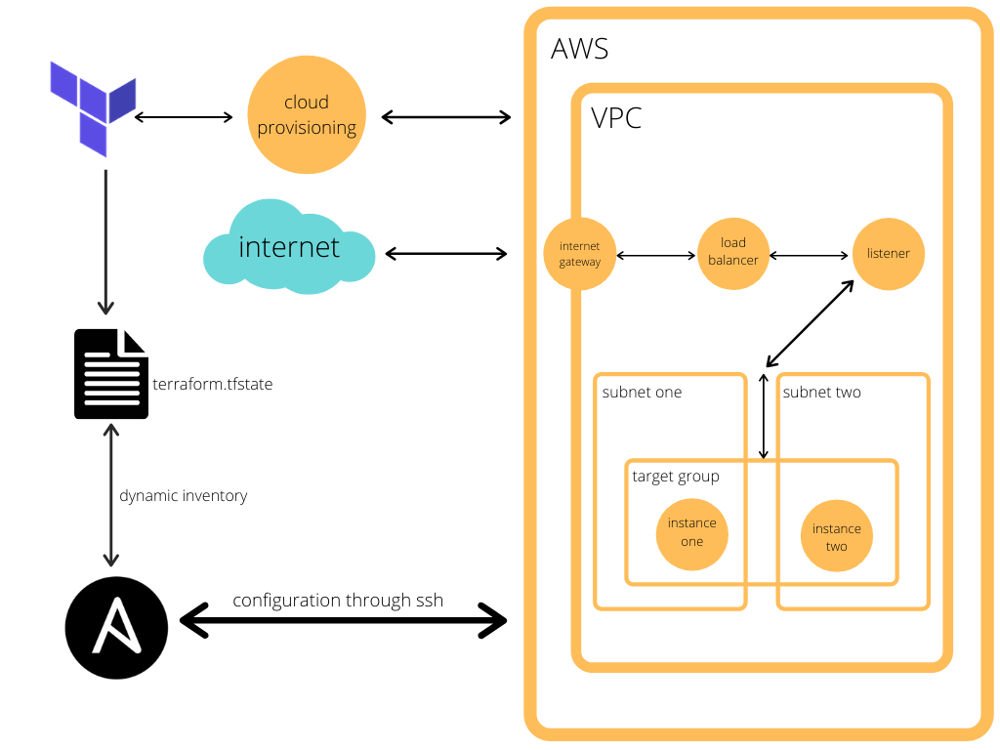

# AcklenDevOpsChallenge

## Challenge Description

This repository is for the Acklen Avenue DevOps recruiting challenge. These are the steps given:

DevOps Challenge

For this project challenge you will need to fork this project: https://github.com/abkunal/Chat-App-using-Socket.io

Your objective for this is to deploy this project to a cloud provider..
Prerequisites:
NodeJs
Ansible
Terraform
Github

Which cloud provider?
In Acklen Avenue we work with AWS. So we will prefer that you can deploy it in AWS. But if you know Azure, GCP or another cloud provider, feel free to work with that specific technology.
E.g
In AWS we use EC2 in Azure the equivalent is Azure Virtual Machine.

All of this work has to be  saved in Github Repository.
You will need to commit all of your work in your repository. When you finished, shared your Github repository to the recruiting email.

Step 1
Prepare the networking. With Terraform, you will do this.
Create a VPC with 2 public subnets in two different availability zones. If this is new to you, take some time to search for this, as you will need to understand this to continue with the challenge.

Step #2
You will need to create 2 EC2 instances and assign them in the VPC created in Step 1.
For doing this you will need to use terraform
Challenge:
In case you want to show you rock with Terraform, instead of using EC2, create an autoscaling group. So we can have dynamic instances.

Step #3
You will need to create an application load balancer for this. The idea is that for accessing the application it has to be using the load balancer. For doing this you will need to use terraform

Step #4
When you have the infrastructure, you will need to install the application. You will need to install node in the EC2 you created in step 2 and configure the application. Remember the application will need to be up always. For doing this, you will need to run ansible for configuring everything.

Step #5
Create a README file and place all the steps. The way we’re going to evaluate this, is following the instructions from this file. So be clear as possible. Explain which are the variables, etc

## Terraform

There are two terraform files: main.tf and variables.tf

### Variables.tf

This is the variables file. It helps make the main terraform code reusable. 

#### region
This variable determines the region in which all the infrastructure will be created.

#### zone_one and zone_two
These two variables specify the availability zones in which the subnets will be created

#### vpc_id
For this challenge, I used the default VPC that comes with the account. This is the id to use with the terraform data source.

#### gateway_id
I also used the default internet gateway for the VPC. This is the id for the data source.

#### subnet_one_block and subnet_two_block
These variables determine the cidr blocks for both subnets.

#### image
This variable specifies the Amazon Machine Image to be used by the EC2 instances. The AMI used is a quick start image.

#### ec2_type
This variable determines the instance type. I used de t2.micro type since it falls into the free tier.

### Main.tf

This file contains the data sources and resources that are to be created.

#### Provider
First we specify the provider and the region we're going to be using, which is AWS and us-east-2

#### Data source : aws_vpc
Since I'm using the default VPC, a data source is used to pull information on the already created resource. The only parameter is the id.

#### Data source: aws_internet_gateway
Same than with the VPC. I'm using an existing resource, so I just need to pull the information from it with a data source.

#### Resource: aws_subnet
The next two resources are the subnets that are going to be created. The parameters are the vpc_id, the availability zone, and the cidr block to be created.

#### Resource: aws_eip
These two resources create elastic ip addresses for the two instances. The application will not be accessed through these addresses, but they are used to connect by ssh and run the ansible configuration. The parameters are the instance_id to associate to, the vpc property set to "true", and I needed to associate it with the instances' private ip address.

#### Resource: aws_key_pair
To be able to connect through ssh to the instances, there needs to be a key pair associated with them. This resource receives the key name and the public key defined in the variables file.

#### Resource: aws_instance
These are the two resources for the EC2 instances. It takes the following parameters: the ami id that is going to be used, the instance type for the machine, the subnet_id of the subnet under which the instance will be created, the security group associated with the instance, the key name for ssh access, and the "Name" tag for the dynamic ansible inventory.

#### Resource: aws_security_group
This resource creates the security group to associate with the instances and the load balancer. It receives the id of the VPC it belongs to, ingress and egress blocks that specifiy the origin and destination port along with the protocol of the traffic and the destination subnet blocks. This is the firewall for the load balancer.

#### Resource: aws_lb
This resource creates the load balancer. The load balancer will distribute the traffic between both instances. We need to specify the subnets to associate it to, the internal property set to false because we want it to be internet-facing, the load_balancer_type set to "application", the security group to which it associates, and the ip address type, in this case "ipv4".

#### Resource: aws_lb_listener
This resource is the listener that we have to create for the load balancer. It monitors for traffic of a specific protocol and takes action with the rules we specify. We pass it the arn of the load balancer it will be created for, the destination port of the incoming traffic, and the action it will take when it receives traffic. The default action is set to forward to both target groups we will create.

#### Resource: aws_lb_target_group
We need to place the instances in target groups for the load balancer to have access to them. The resource needs the vpc it's in, the destination port of incoming traffic, and the protocol of the traffic.

#### Resource: aws_lb_target_group_attachment
With these resources I created the targets in the target group. There is one for each instance. We need to specify the arn of the target group it belongs to, the target id which is the id of the instance, and the destination port of the incoming traffic.

## Ansible

Ansible is a tool to automate IT tasks. In this particular challenge, ansible is used to install and configuring every component needed for the application. An ansible playbook is divided into plays. I made a play for each task to be done for the application. All the hosts in the playbook are named "tag_Name_one" and "tag_Name_two". This is for ansible to be able to recognize the instances with the dynamic inventory. Also, for the plays with which I install packages and configure nginx, the "become" property is set to true. This is because the packages need to be installed with sudo, but it is not necessary for the running of the app.

### Install nginx
This play has 3 tasks. The first is the equivalent to "sudo apt udpate", the second one installs the nginx package, and the third one ensures that the nginx service is running.

### Install node and pm2
This play has 4 tasks. The first one to update the package manager cache, and the other 3 are for installing nodejs, npm, and pm2. PM2, a daemon process manager, is the program that we'll use to make sure that our application is running all the time.

### Run app
In the next play we have 3 tasks. We pull the app from the repository, run "npm install", and then run it using PM2.

### Configure nginx reverse proxy
Here we have 6 tasks. The first one creates the .conf file for our proxy and the second one writes to it. Then we check if a default .conf file exists, and if it exists, we unlink it from the enabled sites. After that, we link our .conf file to the enabled sites folder. Lastly, we need to restart nginx so that the changes can be visible.

With all that, we look for the DNS Name for our Load Balancer and paste it in our browser. The application should be available.

## Infrastructure
The whole infrastructure looks like this.
[]

## To run

To run this challenge:

From terraform folder: "terraform apply"

From ansible folder: "ansible-playbook deploy.yml -i ec2.py --private-key=../keys/instance.pem --user ubuntu"

